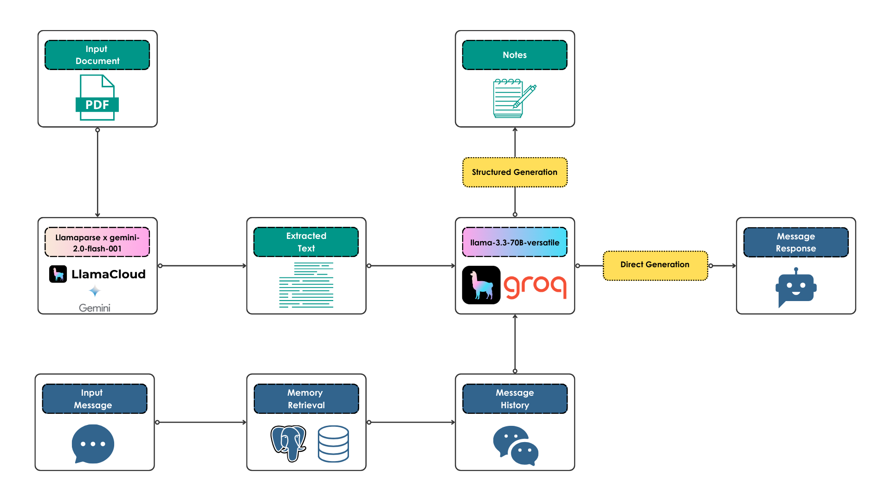

<h1 align="center">Pdf2Notes📝</h1>

<h2 align="center">Turn PDF into Notes in seconds</h2>

<div align="center">
    <h3>If you find Pdf2Notes userful, please consider to donate and support the project:</h3>
    <a href="https://github.com/sponsors/AstraBert"></a>
</div>

**Pdf2Notes** is a simple AI-powered open-source chatbot that helps you speed up your learning by turning your PDF documents into notes, in a matter of seconds. It's powered by [LlamaIndex](https://www.llamaindex.ai), [Groq](https://groq.com), [Gradio](https://gradio.app), [FastAPI](https://fastapi.tiangolo.com/) and [Postgres](https://www.postgresql.org/)

## Install and launch🚀

The first step, common to both the Docker and the source code setup approaches, is to clone the repository and access it:

```bash
git clone https://github.com/AstraBert/pdf2notes.git
cd pdf2notes
```

Once there, you can choose one of the two following approaches:

### Docker (recommended)🐋

> _Required: [Docker](https://docs.docker.com/desktop/) and [docker compose](https://docs.docker.com/compose/)_

- Add the `groq_api_key` and the `llamacloud_api_key` variables in the [`.env.example`](./.env.example) file and modify the name of the file to `scripts/.env`. Get these keys:
    + [On Groq Console](https://console.groq.com/keys)
    + [On LlamaCloud](https://cloud.llamaindex.ai/)

```bash
mv .env.example .env
```

- Launch the Docker application through the dedicated scripts:

```bash
# If you are on Linux/macOS
bash start_services.sh
# If you are on Windows
.\start_services.ps1
```

- Or do it manually:

```bash
docker compose up postgres adminer -d
docker compose up pdf2notes -d
```


You will see the application running on http://localhost:6500/app and you will be able to use it. Depending on your connection and on your hardware, the set up might take some time (up to 15 mins to set up) - but this is only for the first time your run it!

### Source code🗎

> _Required: [Docker](https://docs.docker.com/desktop/), [docker compose](https://docs.docker.com/compose/) and [conda](https://anaconda.org/anaconda/conda)_

- Add the `groq_api_key` and the `llamacloud_api_key` variables in the [`.env.example`](./.env.example) file and modify the name of the file to `scripts/.env`. Get these keys:
    + [On Groq Console](https://console.groq.com/keys)
    + [On LlamaCloud](https://cloud.llamaindex.ai/)

```bash
mv .env.example scripts/.env
```

- Set up Pdf2Notes using the dedicated script:

```bash
# For MacOs/Linux users
bash setup.sh
# For Windows users
.\setup.ps1
```

- Or you can do it manually, if you prefer:

```bash
docker compose up postgres adminer -d

conda env create -f environment.yml

conda activate pdf2notes

cd scripts

uvicorn main:app --host 0.0.0.0 --port 6500

conda deactivate
```

You will see the application running on http://localhost:6500/app and you will be able to use it.

## How it works

<div align='center'>
    
</div>

### Database services

- **Postgres** manages the chat-based memory that the application can update and access, containing all the chat history
- **Adminer** is a database management and control system, that lets you check your Postgres databases

### Workflow

The workflow is split into two parts:

- First, you upload a PDF document
- The document is processed by LlamaParse with Gemini 2.0 as a multimodal parsing model
- The extracted text is returned to Llama-3.3-70B, provisioned through Groq, which produces notes about the document

In the second part, you can modify the nodes by interacting with the chatbot:

- You message will be passed to the chatbot, along will retrieve the last 10 messages from the memory
- The LLM will reply based on the memory-enhanced context

## Contributing

Contributions are always welcome! Follow the contributions guidelines reported [here](CONTRIBUTING.md).

## License and rights of usage

The software is provided under MIT [license](./LICENSE).
